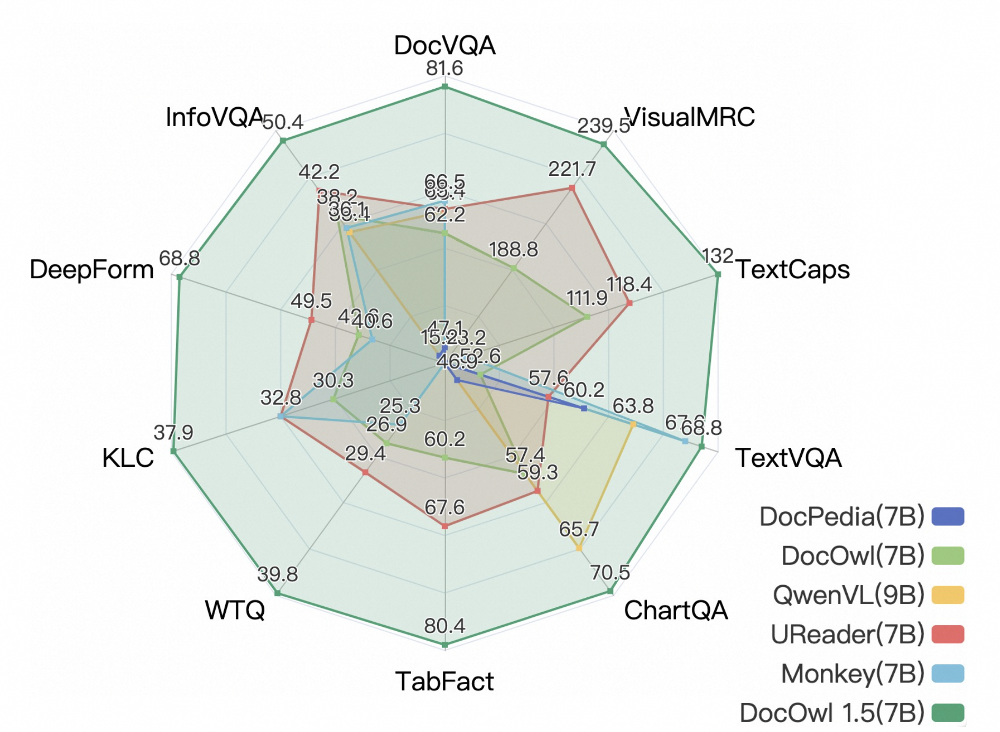
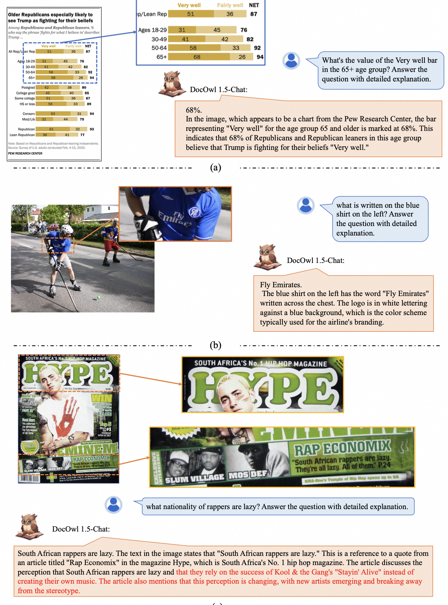

# mPLUG-DocOwl 1.5: Unified Structure Learning for OCR-free Document Understanding

<div align="center">
Anwen Hu, Haiyang Xu†, Jiabo Ye, Ming Yan†, Liang Zhang, Bo Zhang, Chen Li, Ji Zhang, Qin Jin, Fei Huang, Jingren Zhou

† Corresponding Author

</div>


<div align="center">
<a href="http://arxiv.org/abs/2403.12895"></a>
</div>
<div align="center">
Data: 
DocStruct4M 
<a href="https://huggingface.co/datasets/mPLUG/DocStruct4M">🤗</a><a href="https://www.modelscope.cn/datasets/iic/DocStruct4M/"> </a>
DocReason25K <a href="https://huggingface.co/datasets/mPLUG/DocReason25K">🤗</a><a href="https://www.modelscope.cn/datasets/iic/DocReason25K/"> </a>
DocDownstream <a href="https://huggingface.co/datasets/mPLUG/DocDownstream-1.0">🤗</a><a href="https://www.modelscope.cn/datasets/iic/DocDownstream-1.0/"> </a>
DocLocal4K <a href="https://huggingface.co/datasets/mPLUG/DocLocal4K">🤗</a><a href="https://www.modelscope.cn/datasets/iic/DocLocal4K/"> </a>
</div>
<div align="center">
Models:
DocOwl1.5-stage1 <a href="https://huggingface.co/mPLUG/DocOwl1.5-stage1">🤗</a><a href="https://www.modelscope.cn/models/iic/DocOwl1.5-stage1/"> </a>
DocOwl1.5 <a href="https://huggingface.co/mPLUG/DocOwl1.5">🤗</a><a href="https://www.modelscope.cn/models/iic/DocOwl1.5/"> </a>
DocOwl1.5-Chat <a href="https://huggingface.co/mPLUG/DocOwl1.5-Chat">🤗</a><a href="https://www.modelscope.cn/models/iic/DocOwl1.5-Chat/"> </a>
DocOwl1.5-Omni <a href="https://huggingface.co/mPLUG/DocOwl1.5-Omni">🤗</a><a href="https://www.modelscope.cn/models/iic/DocOwl1.5-Omni/"> </a>
</div>


<hr>
<div align="center">


</div>
</p>

## Spotlights

* Support struct-aware document parsing, table to markdown, chart to markdown.
* Support multi-grained text recognition and text grounding
* Support question answering with simple phrases or detailed explanations.

* Open Source
    - ✅ Training Data: DocStruct4M, DocReason25K, DocDownsteam-1.0
    - ✅ Mutli-grained Text Localization Evaluation set: DocLocal4K
    - ✅ Model: DocOwl1.5-stage1, DocOwl1.5, DocOwl1.5-Chat, DocOwl1.5-Omni
    - ✅ Source code of model inference and evaluation.
    - ✅ Online Demo on ModelScope and HuggingFace.
    - ✅ Source code of launching a local demo.
    - ✅ Training code.

## Demos
🤗 [HuggingFace Space](https://huggingface.co/spaces/mPLUG/DocOwl)

 [ModelScope Space](https://modelscope.cn/studios/iic/mPLUG-DocOwl/) 

## Training and Evaluation Datasets
|  Dataset   | Download Link |
|  ----  | ----  | 
|  DocStruct4M   | <li>[HuggingFace: mPLUG/DocStruct4M](https://huggingface.co/datasets/mPLUG/DocStruct4M) <li> [ModelScope: iic/DocStruct4M](https://www.modelscope.cn/datasets/iic/DocStruct4M)|
|  DocDownstream-1.0   | <li>[HuggingFace: mPLUG/DocDownstream-1.0](https://huggingface.co/datasets/mPLUG/DocDownstream-1.0) <li> [ModelScope: iic/DocDownstream-1.0](https://www.modelscope.cn/datasets/iic/DocDownstream-1.0)|
|  DocReason25K   | <li>[HuggingFace: mPLUG/DocReason25K](https://huggingface.co/datasets/mPLUG/DocReason25K) <li> [ModelScope: iic/DocReason25K](https://www.modelscope.cn/datasets/iic/DocReason25K)|
|  DocLocal4K   | <li>[HuggingFace: mPLUG/DocLocal4K](https://huggingface.co/datasets/mPLUG/DocLocal4K) <li> [ModelScope: iic/DocLocal4K](https://www.modelscope.cn/datasets/iic/DocLocal4K)|


### DocStruct4M
DocStruct4M is a training set for Unified Structure Learning, covering images of documents, webpages, tables, charts and natural images. It consists of ~3M samples for Struct-aware Parsing tasks and ~1M samples for Multi-grained Text Localization tasks. 

Download DocStruct4M dataset from huggingface [mPLUG/DocStruct4M](https://huggingface.co/datasets/mPLUG/DocStruct4M). Training images (~311G) are split into 8 files, run following cmds to prepare training and validation images.
```
cat partial-imgs* > imgs.tar.gz
tar -zxvf imgs.tar.gz
tar -zxvf val_imgs.tar.gz
```

The dataset is organized in such format:
```
DocStruct4M
├── imgs
├── val_imgs
├── multi_grained_text_localization.jsonl
├── struct_aware_parse.jsonl
├── val.jsonl
```
The ```./imgs``` and ```./val_imgs``` directory contains images for the training and validation samples, respectively. 

### DocDownstream-1.0
DocDownstream-1.0 is the combination of 10 text-rich image understanding benchmarks, including DocVQA, InfographicsVQA, DeepForm, KleisterCharity, WikiTableQuestions, TabFact, ChartQA, TextCaps, TextVQA and VisualMRC, covering tasks of Information Extraction, Visual Question Answering, Natural Language Inference and Image Captioning. All tasks are unified in the form of Visual Question Answering.

Download DocDownstream-1.0 dataset from huggingface [mPLUG/DocDownstream-1.0](https://huggingface.co/datasets/mPLUG/DocDownstream-1.0). Images (~70G) are split into 2 files, run following cmds to prepare images.
```
cat partial-imgs* > imgs.tar.gz
tar -zxvf imgs.tar.gz
```

The dataset is organized in such format:
```
DocDownstream-1.0
├── meta
├── test
├── imgs
├── train.jsonl
├── val.jsonl
```
The ```./imgs``` directory contains images for the training/validation/test samples. The ```train.jsonl``` and ```val.jsonl``` are ensembled samples of 10 datasets for training and validation. There are ~57w samples in ```train.jsonl```. The ```./test``` directory contain test files for each dataset. The ```./meta``` directory contain meta files used for evaluation. 

### DocReason25K
DocReason25K is instruction tuning set with detailed explanation for Visual Document Understanding. It's built based on training samples from DocVQA, InfographicsVQA, WikiTableQuestions, VisualMRC, ChartQA and TextVQA. Detailed explanations are given by GPT3.5/GPT4V and further filtred according to manually annoatetd simple answer.

Download DocReason25K dataset from huggingface [mPLUG/DocReason25K](https://huggingface.co/datasets/mPLUG/DocReason25K). 
The dataset is organized in such format:
```
DocReason25K
├── imgs
├── detailed_explanation.jsonl
```

### DocLocal4K
DocLocal4K is a evaluation set for Multi-grained Text Localization, covering both text recognition and text grounding tasks.

Download DocLocal4K dataset from huggingface [mPLUG/DocLocal4K](https://huggingface.co/datasets/mPLUG/DocLocal4K). 
The dataset is organized in such format:
```
DocLocal4K
├── imgs
├── text_grounding.jsonl
├── text_recognition.jsonl
```

## Models
### Model Card
|  Model   | Download Link  | Abilities |
|  ----  | ----  | ----  |
| DocOwl1.5-stage1  | <li> 🤗[ mPLUG/DocOwl1.5-stage1](https://huggingface.co/mPLUG/DocOwl1.5-stage1) <li>  [iic/DocOwl1.5-stage1](https://www.modelscope.cn/models/iic/DocOwl1.5-stage1/) | <li> document/webpage parsing <li> table to markdown <li> chart to markdown <li> natural image parsing <li> multi-grained text recognition <li> multi-grained text  grounding |
| DocOwl1.5  | <li> 🤗 [mPLUG/DocOwl1.5](https://huggingface.co/mPLUG/DocOwl1.5) <li>  [iic/DocOwl1.5](https://www.modelscope.cn/models/iic/DocOwl1.5/) | <li> VQA with concise answers <li> infomation extraction <li> image captioning <li> natural language inference |
| DocOwl1.5-Chat  | <li> 🤗 [mPLUG/DocOwl1.5-Chat](https://huggingface.co/mPLUG/DocOwl1.5-Chat) <li>  [iic/DocOwl1.5-Chat](https://www.modelscope.cn/models/iic/DocOwl1.5-Chat/) | <li> VQA with detailed explanations <li> VQA with concise answers <li> infomation extraction <li> image captioning <li> natural language inference |
| DocOwl1.5-Omni  |  <li> 🤗 [mPLUG/DocOwl1.5-Omni](https://huggingface.co/mPLUG/DocOwl1.5-Omni) <li>  [iic/DocOwl1.5-Omni](https://www.modelscope.cn/models/iic/DocOwl1.5-Omni/) | <li> document/webpage parsing <li> table to markdown <li> chart to markdown <li> natural image parsing <li> multi-grained text recognition <li> multi-grained text grounding <li> VQA with detailed explanations <li> VQA with concise answers <li> infomation extraction <li> image captioning <li> natural language inference |

### Model Inference
prepare python environments as [mPLUG-Owl2](https://github.com/X-PLUG/mPLUG-Owl/tree/main/mPLUG-Owl2). Versions of some important packages are: ```transformers==4.31.0```

* DocOwl1.5-stage1 inference examples
```
from docowl_infer import DocOwlInfer
model_path='./mPLUG/DocOwl1.5-stage1'
docowl=DocOwlInfer(ckpt_path=model_path, anchors='grid_9', add_global_img=False)
print('load model from ', model_path)

# document/webpage parsing
image='./DocStruct4M/val_imgs/CCpdf/pages/1e531ef22cff3f01dab8720e99427c4f_page19.png'
query='Recognize text in the image.'
answer=docowl.inference(image, query)
print(answer)

# table/chart to markdown
image='./DocStruct4M/val_imgs/TURL/col_type_197091.jpg'
query='Convert the picture to Markdown syntax.'
answer=docowl.inference(image, query)
print(answer)

# natural image parsing
image='./DocStruct4M/val_imgs/OCRCC/02749938.jpg'
query='Provide a description of the image content and text.'
answer=docowl.inference(image, query)
print(answer)
```

* DocOwl1.5-Chat inference examples
```
from docowl_infer import DocOwlInfer
model_path='./mPLUG/DocOwl1.5-chat'
docowl=DocOwlInfer(ckpt_path=model_path, anchors='grid_9', add_global_img=True)
print('load model from ', model_path)

# VQA with concise phrases
image='./DocDownstream-1.0/imgs/DUE_Benchmark/DocVQA/pngs/rnbx0223_193.png'
query='What is the Compound Annual Growth Rate (CAGR) for total assets?'
answer=docowl.inference(image, query)
print(answer)

# VQA with detailed explanation
image='./DocDownstream-1.0/imgs/DUE_Benchmark/DocVQA/pngs/rnbx0223_193.png'
query='What is the Compound Annual Growth Rate (CAGR) for total assets? Answer the question with detailed explanation.'
answer=docowl.inference(image, query)
print(answer)
```

### Model Evaluation
prepare environments for evaluation as follows:
```
pip install textdistance
pip install editdistance
pip install pycocoevalcap
```

Evaluate DocOwl1.5/DocOwl1.5-Chat on 10 downstream tasks:
```
python docowl_benchmark_evaluate.py --model_path $MODEL_PATH --dataset $DATASET --downstream_dir $DOWNSTREAM_DIR_PATH --save_dir $SAVE_DIR
```
Note: ```$DATASET``` should be chosen from ```[DocVQA, InfographicsVQA, WikiTableQuestions, DeepForm,KleisterCharity, TabFact, ChartQA, TextVQA, TextCaps, VisualMRC]```. ```$DOWNSTREAM_DIR_PATH``` is the local path of [mPLUG/DocDownstream-1.0](https://huggingface.co/datasets/mPLUG/DocDownstream-1.0).

Evaluate DocOwl1.5-stage1 on DocLocal4K:
```
python docowl_doclocal4k_evaluate.py --model_path $MODEL_PATH --task $TASK --doclocal4k_dir $DOCLOCAL4K_DIR_PATH --save_dir $SAVE_DIR
```
Note: ```$TASK``` should be chosen from ```[text_grounding, text_recognition]```. ```$DOCLOCAL4K_DIR_PATH``` is the local path of [mPLUG/DocLocal4K](https://huggingface.co/datasets/mPLUG/DocLocal4K).

### Model Training
You can further finetune your own models based on DocOwl 1.5 models.
1. Prepare a training jsonl file, organize each training sample in the same format as follows:

  ```{"image": ["./imgs/DUE_Benchmark/DocVQA/pngs/xnbl0037_1.png"], "messages": [{"role": "user", "content": "<|image|>what is the date mentioned in this letter?"}, {"role": "assistant", "content": "1/8/93"}], "task_name": "qa_sft", "dataset_name": "DocVQA"}```

2. Modify parameters in ```./scripts/finetune_docowl.sh``` according to your personal needs. ```./scripts/finetune_docowl.sh``` provides an example of finetuning DocDownstream-1.0 based on DocOwl1.5-stage1.

3. Run ```bash ./scripts/finetune_docowl.sh```.

Note: Our DocOwl 1.5 is trained with Megatron. We additionaly build training codes supported by DeepSpeed for open-sourcing. We have tested the training scripts runs well on A100-80g with zero2. But We meet deadlock issues when using zero3. If you are willing to share any ideas about how to fix the deadlock issues of zero3, we will appreciate very much!


## Local Demo
Run the following command to launch a local demo supported by the DocOwl1.5-Omni:
```
python app.py --model-source modelscope
```
Note: The demo is build based on ```gradio==3.27.0```. If you must use ```gradio==4.26.0```, you can refer to our code on HuggingFace space by ```git clone https://huggingface.co/spaces/mPLUG/DocOwl``` . You can also change ```model-source``` to ```huggingface```, or ```local``` and specify the ```model-path```. We have verified that the local demo works on A100-80G or V100-32G.


## Citation
If you found this work useful, consider giving this repository a star and citing our paper as followed:
```
@article{hu2024docowl,
  title={mPLUG-DocOwl 1.5: Unified Structure Learning for OCR-free Document Understanding},
  author={Hu, Anwen and Xu, Haiyang and Ye, Jiabo and Yan, Ming and Zhang, Liang and Zhang, Bo and Li, Chen and Zhang, Ji and Jin, Qin and Huang, Fei and others},
  journal={arXiv preprint arXiv:2403.12895},
  year={2024}
}
```

          
