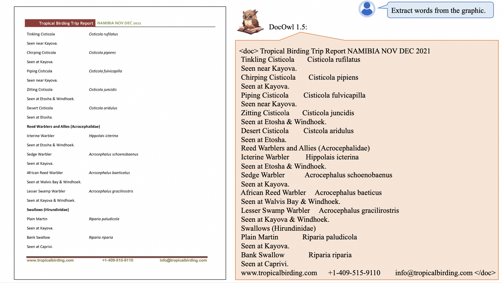
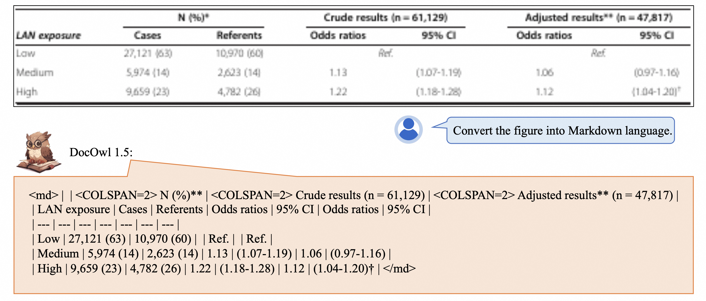
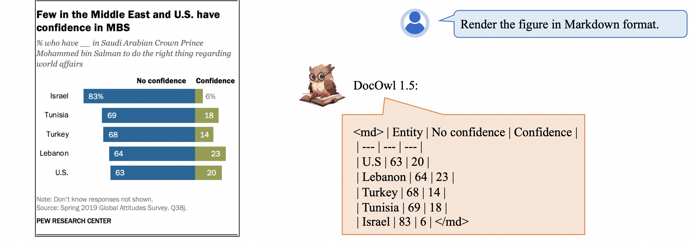
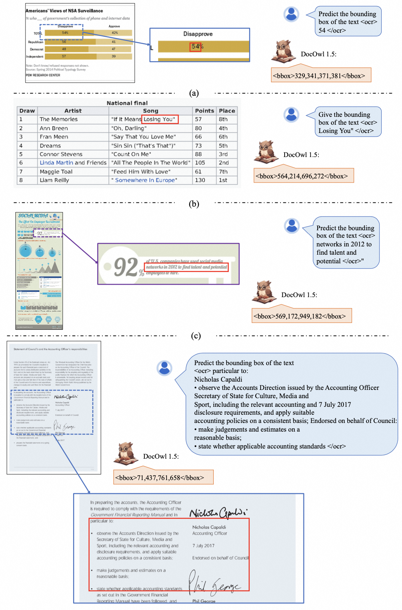

# mPLUG-DocOwl 1.5: Unified Structure Learning for OCR-free Document Understanding

Anwen Hu, Haiyang Xu†, Jiabo Ye, Ming Yan†, Liang Zhang, Bo Zhang, Chen Li, Ji Zhang, Qin Jin, Fei Huang

† Corresponding Author

Coming soon
