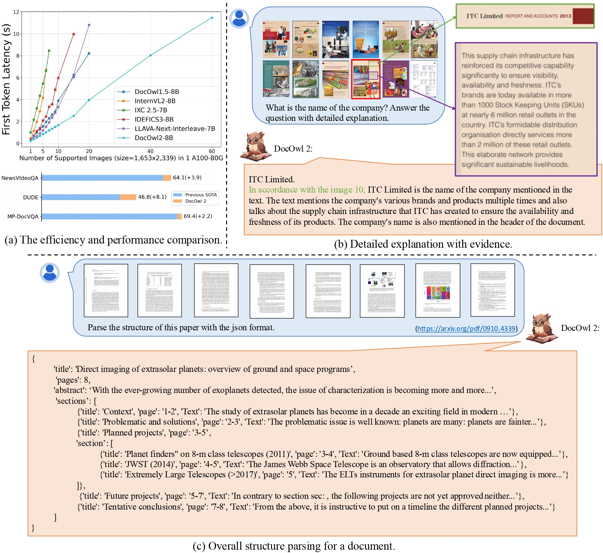

# mPLUG-DocOwl2: High-resolution Compressing for OCR-free Multi-page Document Understanding

<div align="center">
Anwen Hu, Haiyang Xu†, Liang Zhang, Jiabo Ye, Ming Yan†, Ji Zhang, Qin Jin, Fei Huang, Jingren Zhou

† Corresponding Author

</div>


<div align="center">
<a href="https://arxiv.org/abs/2409.03420"></a>
</div>
<div align="center">
Data: 
MP-DocStruct1M
<a href="">🤗</a><a href=""> </a>
MP-DocReason51K <a href="">🤗</a><a href=""> </a>
DocDownstream 2.0 <a href="">🤗</a><a href=""> </a>
</div>
<div align="center">
Models:
DocOwl2-stage1 <a href="">🤗</a><a href=""> </a>
DocOwl2-stage2 <a href="">🤗</a><a href=""> </a>
DocOwl2 <a href="https://huggingface.co/mPLUG/DocOwl2">🤗</a><a href="https://modelscope.cn/models/iic/DocOwl2"> </a>
</div>


<hr>
<div align="center">

</div>
</p>

## Spotlights

* Support Multi-page Text Lookup and Multi-page Text Parsing.
* Support Multi-page Question Answering using simple phrases or detailed explanations with evidence pages.
* Support Text-rich Video Understanding.

* Open Source
    - [ ] Training Data: MP-DocStruct1M, MP-DocReason51K, DocDownsteam-2.0
    - [ ] Model: DocOwl2-stage1, DocOwl2-stage2, DocOwl2
    - [ ] Source code of model inference and evaluation.
    - [ ]  Online Demo on ModelScope and HuggingFace.
    - [ ]  Source code of launching a local demo.
    - [ ] Training code.

## Models
### Model Card
|  Model   | Download Link  | Abilities |
|  ----  | ----  | ----  |
| DocOwl2  | <li> 🤗 [mPLUG/DocOwl2](https://huggingface.co/mPLUG/DocOwl2) <li>  [iic/DocOwl2](https://modelscope.cn/models/iic/DocOwl2) | <li> Multi-page VQA with detailed explanations <li> Multi-page VQA with concise answers |

### Model Inference

```
import torch
import os
from transformers import AutoTokenizer, AutoModel
from icecream import ic
import time

class DocOwlInfer():
    def __init__(self, ckpt_path):
        self.tokenizer = AutoTokenizer.from_pretrained(ckpt_path, use_fast=False)
        self.model = AutoModel.from_pretrained(ckpt_path, trust_remote_code=True, low_cpu_mem_usage=True, torch_dtype=torch.float16, device_map='auto')
        self.model.init_processor(tokenizer=self.tokenizer, basic_image_size=504, crop_anchors='grid_12')
        
    def inference(self, images, query):
        messages = [{'role': 'USER', 'content': '<|image|>'*len(images)+query}]
        answer = self.model.chat(messages=messages, images=images, tokenizer=self.tokenizer)
        return answer


docowl = DocOwlInfer(ckpt_path='mPLUG/DocOwl2')

images = [
        './examples/docowl2_page0.png',
        './examples/docowl2_page1.png',
        './examples/docowl2_page2.png',
        './examples/docowl2_page3.png',
        './examples/docowl2_page4.png',
        './examples/docowl2_page5.png',
    ]

answer = docowl.inference(images, query='what is this paper about? provide detailed information.')

answer = docowl.inference(images, query='what is the third page about? provide detailed information.')
```
