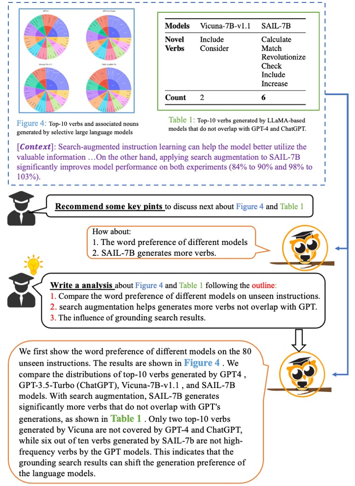
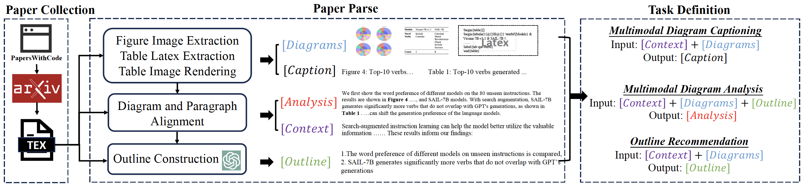
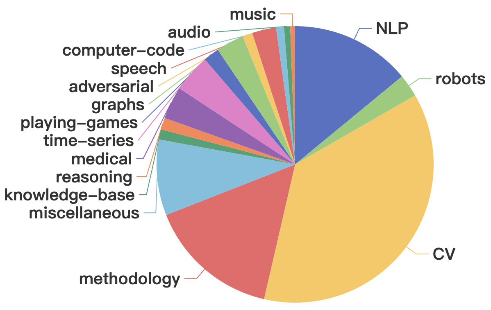
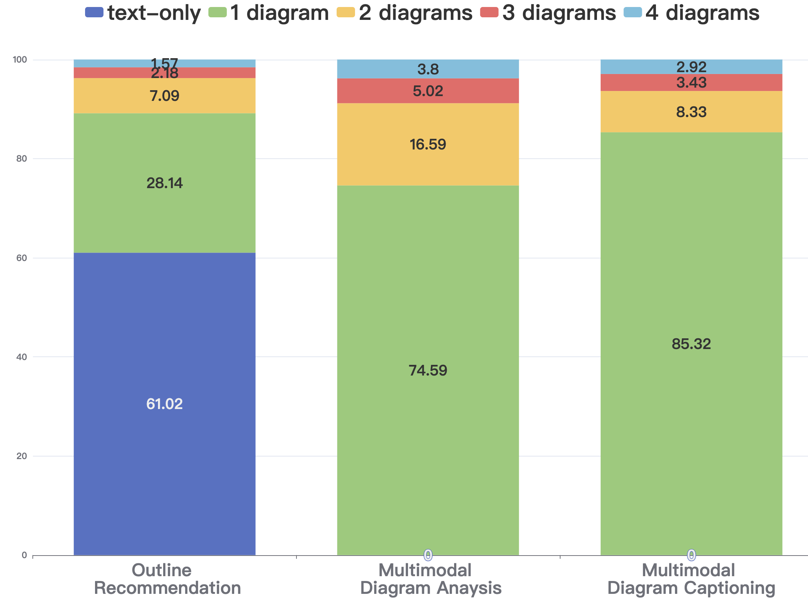

# mPLUG-PaperOwl: Scientific Diagram Analysis with the Multimodal Large Language Model

<div align="center">

Anwen Hu*, Yaya Shi*, Haiyang Xu†, Jiabo Ye, Qinghao Ye, Ming Yan†, Chenliang Li, Qi Qian, Ji Zhang, Fei Huang

Alibaba Group

*Equal Contribution; † Corresponding Author

</div>

<hr>
<div align="center">
<a href="http://anwenhu.oss-cn-zhangjiakou.aliyuncs.com/PaperOwl_arxiv.pdf"></a>
<a href="https://arxiv.org/abs/2311.18248"></a>
<p></div>
<div align="center">
<a href="https://huggingface.co/datasets/mPLUG/M-Paper">M-Paper 🤗</a></div>
<div align="center">

</div>
</p>

## M-Paper

M-Paper is a Scientific Diagram Analysis dataset based on 48k high-quality arxiv papers (2021~2023) on Machine Learning. M-Paper contains 447k diagram images and supports 3 tasks: Diagram Captioning, Diagram Analysis and Outline Recommendation.


The construction pipeline of M-Paper is as follows:


Download M-Paper dataset from huggingface [mPLUG/M-Paper](https://huggingface.co/datasets/mPLUG/M-Paper). High-resolution images (~639G) are split into 16 files, run following cmds to prepare images.
```
cat partial-imgs* > imgs.tar.gz
tar -zxvf imgs.tar.gz
```

The dataset is orgnized in such format:
```
M-Paper
├── imgs
├── sft
│   ├── 3tasks_{split}.jsonl
│   ├── cap_{split}.jsonl
│   ├── analysis_{split}.jsonl
│   └── outline_{split}.jsonl
├── meta
│   ├── cap_{split}.jsonl
│   ├── analysis_{split}.jsonl
│   └── outline_{split}.jsonl
```
The ```./imgs``` directory contains figure or table images. Files in the ```./sft``` directory are the instruction-tuning data. The "cap", "analysis" and "outline" refer to "Diagram Captioning", "Diagram Analysis" and "Outline Recommendation", respectively. Files in the ```./meta``` directory store different components, e.g. [Context], [Outline], [Table_Latex], [Question], [Answer]，etc, of each sample in a dictionary format. 

The statistic of sample number of each task in M-Paper is shown as follows:

| Task      |   Train | Val | Test | 
| ----------- | ----------- | ----------- | ----------- |
| Diagram Captioning      | 343,546   | 1,131 | 1,133
| Diagram Analysis   | 267,476 | 1,087 | 1,195 |
| Outline Recommendation   | 78,041 | 3,425 | 3,442 |


The "task_type" item in each sample is organzied as $Object_$Task, where $Object indicates the understanding objects, including "figure", "table", "tablelatex", "figure_table" and "figure_tablelatex". $Task indicates the task, including "cap", "analysis", "outline_to_analysis", "simple_outline" and "detailed_outline".

<div align="center">


</div>
</p>


## Training, Inference and Evaluation
### Environment
Follow [mPLUG-Owl](https://github.com/X-PLUG/mPLUG-Owl) to prepare your environment.

We validate the codes with: 
* PyTorch 1.13.1
* CUDA 11.7
* transformers 4.29.1.

### Training
Prepare the checkpoint of mPLUG-Owl from [https://huggingface.co/MAGAer13/mplug-owl-llama-7b](https://huggingface.co/MAGAer13/mplug-owl-llama-7b). Put the download checkpoint in ```checkpoints/mplug-owl-llama-7b```.

For A100 80G
```
bash scripts/train_it.sh
```
For V100 32G
```
bash scripts/train_it_v100.sh
```

## Citation
If you found this work useful, consider giving this repository a star and citing our paper as followed:
```
@article{hu2023paperowl,
  title={mplug-paperowl: Scientific diagram analysis with the multimodal large language model},
  author={Hu, Anwen and Shi, Yaya and Xu, Haiyang and Ye, Jiabo and Ye, Qinghao and Yan, Ming and Li, Chenliang and Qian, Qi and Zhang, Ji and Huang, Fei},
  journal={arXiv preprint arXiv:2311.18248},
  year={2023}
}
```