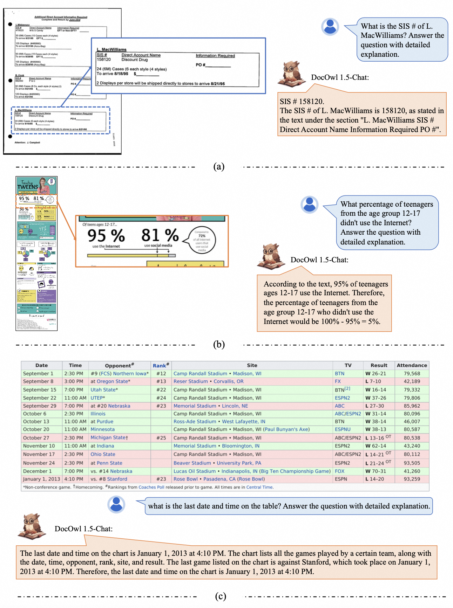

<h2>The Powerful Multi-modal LLM Family

for OCR-free Document Understanding<h2>
<strong>Alibaba Group</strong>

## News
* 🔥🔥 [2024.4.3] We build a demo of DocOwl1.5 on [ModelScope](https://modelscope.cn/studios/iic/mPLUG-DocOwl/) , supported by the DocOwl1.5-Omni.
* 🔥[2024.3.28] We release the training data (DocStruct4M, DocDownstream-1.0, DocReason25K), codes and models (DocOwl1.5-stage1, DocOwl1.5, DocOwl1.5-Chat, DocOwl1.5-Omni) of [mPLUG-DocOwl 1.5](./DocOwl1.5/) on both **HuggingFace** 🤗 and **ModelScope** .
* [2024.3.20] We release the arxiv paper of [mPLUG-DocOwl 1.5](http://arxiv.org/abs/2403.12895), a SOTA 8B Multimodal LLM on OCR-free Document Understanding (DocVQA 82.2, InfoVQA 50.7, ChartQA 70.2, TextVQA 68.6).
* [2024.01.13] Our Scientific Diagram Analysis dataset [M-Paper](https://github.com/X-PLUG/mPLUG-DocOwl/tree/main/PaperOwl) has been available on both **HuggingFace** 🤗 and **ModelScope** , containing 447k high-resolution diagram images and corresponding paragraph analysis.
* [2023.10.13] Training data, models of [mPLUG-DocOwl](./DocOwl/)/[UReader](./UReader/) has been open-soruced.
* [2023.10.10] Our paper [UReader: Universal OCR-free Visually-situated Language Understanding with Multimodal Large Language Model](https://arxiv.org/abs/2310.05126) is accepted by EMNLP 2023.
<!-- * 🔥 [10.10] The source code and instruction data will be released in [UReader](https://github.com/LukeForeverYoung/UReader). -->
* [2023.07.10] The demo of mPLUG-DocOwl on [ModelScope](https://modelscope.cn/studios/damo/mPLUG-DocOwl/summary) is avaliable.
* [2023.07.07] We release the technical report and evaluation set of mPLUG-DocOwl.

## Models
- [**mPLUG-DocOwl1.5**](./DocOwl1.5/) (Arxiv 2024) - mPLUG-DocOwl 1.5: Unified Structure Learning for OCR-free Document Understanding

- [**mPLUG-PaperOwl**](./PaperOwl/) (Arxiv 2023) - mPLUG-PaperOwl: Scientific Diagram Analysis with the Multimodal Large Language Model

- [**UReader**](./UReader/) (EMNLP 2023) - UReader: Universal OCR-free Visually-situated Language Understanding with Multimodal Large Language Model

- [**mPLUG-DocOwl**](./DocOwl/) (Arxiv 2023) - mPLUG-DocOwl: Modularized Multimodal Large Language Model for Document Understanding

## Online Demo

### ModelScope (supported by DocOwl1.5-Omni)

### HuggingFace
Coming soon... 

## Cases

  

## Related Projects

* [mPLUG](https://github.com/alibaba/AliceMind/tree/main/mPLUG).
* [mPLUG-2](https://github.com/alibaba/AliceMind).
* [mPLUG-Owl](https://github.com/X-PLUG/mPLUG-Owl)
