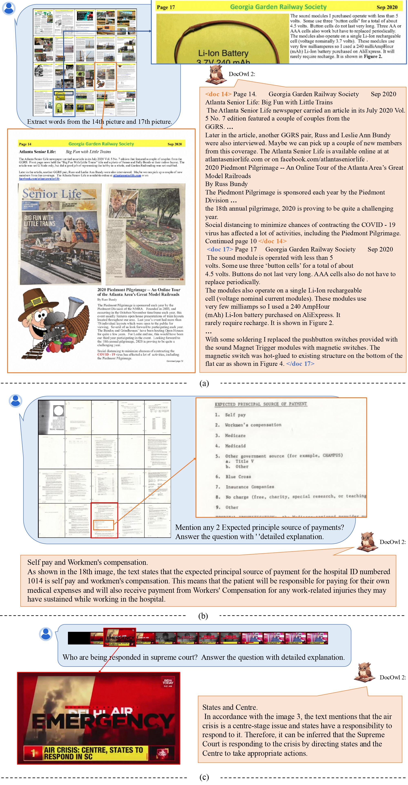

<h2>The Powerful Multi-modal LLM Family

for OCR-free Document Understanding<h2>
<strong>Alibaba Group</strong>

## 📢 News
* 🔥🔥🔥 [2024.12.24] We have released the training code of DocOwl2 by [**ms-swift**](https://github.com/modelscope/ms-swift)! Now you can finetune a stronger model with your own data based on DocOwl2!
* 🔥🔥🔥 [2024.9.28] We have released the training data, inference code and evaluation code of [DocOwl2](./DocOwl2/) on both **HuggingFace** 🤗 and **ModelScope** .
* 🔥🔥🔥 [2024.9.20] Our paper [DocOwl 1.5](http://arxiv.org/abs/2403.12895) and [TinyChart](https://arxiv.org/abs/2404.16635) is accepted by EMNLP 2024.
* 🔥🔥 [2024.9.06] We release the arxiv paper of [mPLUG-DocOwl 2](https://arxiv.org/abs/2409.03420), a SOTA 8B Multimodal LLM on OCR-free Multipage Document Understanding, each document image is encoded with just 324 tokens!
* [2024.7.16] Our paper [PaperOwl](https://arxiv.org/abs/2311.18248) is accepted by ACM MM 2024.
* [2024.5.08] We have released the training code of [DocOwl1.5](./DocOwl1.5/) supported by DeepSpeed. You can now finetune a stronger model based on DocOwl1.5!
* [2024.4.26] We release the arxiv paper of [TinyChart](https://arxiv.org/abs/2404.16635), a SOTA 3B Multimodal LLM for Chart Understanding with Program-of-Throught ability (ChartQA: 83.6 > Gemin-Ultra 80.8 > GPT4V 78.5). The demo of TinyChart is available on [HuggingFace](https://huggingface.co/spaces/mPLUG/TinyChart-3B) 🤗. Both codes, models and data are released in [TinyChart](./TinyChart/).
* [2024.4.3] We build demos of DocOwl1.5 on both [ModelScope](https://modelscope.cn/studios/iic/mPLUG-DocOwl/)  and [HuggingFace](https://huggingface.co/spaces/mPLUG/DocOwl) 🤗, supported by the DocOwl1.5-Omni. The source codes of launching a local demo are also released in [DocOwl1.5](./DocOwl1.5/).
* [2024.3.28] We release the training data (DocStruct4M, DocDownstream-1.0, DocReason25K), codes and models (DocOwl1.5-stage1, DocOwl1.5, DocOwl1.5-Chat, DocOwl1.5-Omni) of [mPLUG-DocOwl 1.5](./DocOwl1.5/) on both **HuggingFace** 🤗 and **ModelScope** .
* [2024.3.20] We release the arxiv paper of [mPLUG-DocOwl 1.5](http://arxiv.org/abs/2403.12895), a SOTA 8B Multimodal LLM on OCR-free Document Understanding (DocVQA 82.2, InfoVQA 50.7, ChartQA 70.2, TextVQA 68.6).
* [2024.01.13] Our Scientific Diagram Analysis dataset [M-Paper](https://github.com/X-PLUG/mPLUG-DocOwl/tree/main/PaperOwl) has been available on both **HuggingFace** 🤗 and **ModelScope** , containing 447k high-resolution diagram images and corresponding paragraph analysis.
* [2023.10.13] Training data, models of [mPLUG-DocOwl](./DocOwl/)/[UReader](./UReader/) has been open-sourced.
* [2023.10.10] Our paper [UReader](https://arxiv.org/abs/2310.05126) is accepted by EMNLP 2023.
<!-- * 🔥 [10.10] The source code and instruction data will be released in [UReader](https://github.com/LukeForeverYoung/UReader). -->
* [2023.07.10] The demo of mPLUG-DocOwl on [ModelScope](https://modelscope.cn/studios/damo/mPLUG-DocOwl/summary) is avaliable.
* [2023.07.07] We release the technical report and evaluation set of mPLUG-DocOwl.

## 🤖 Models
- [**mPLUG-DocOwl2**](./DocOwl2/) (Arxiv 2024) - mPLUG-DocOwl2: High-resolution Compressing for OCR-free Multi-page Document Understanding

- [**mPLUG-DocOwl1.5**](./DocOwl1.5/) (EMNLP 2024) - mPLUG-DocOwl 1.5: Unified Structure Learning for OCR-free Document Understanding

- [**TinyChart**](./TinyChart/) (EMNLP 2024) - TinyChart: Efficient Chart Understanding with
Visual Token Merging and Program-of-Thoughts Learning

- [**mPLUG-PaperOwl**](./PaperOwl/) (ACM MM 2024) - mPLUG-PaperOwl: Scientific Diagram Analysis with the Multimodal Large Language Model

- [**UReader**](./UReader/) (EMNLP 2023) - UReader: Universal OCR-free Visually-situated Language Understanding with Multimodal Large Language Model

- [**mPLUG-DocOwl**](./DocOwl/) (Arxiv 2023) - mPLUG-DocOwl: Modularized Multimodal Large Language Model for Document Understanding

## 📺 Online Demo
Note: The demo of HuggingFace is not as stable as ModelScope because the GPU in ZeroGPU Spaces of HuggingFace is dynamically assigned.
### 📖 DocOwl 1.5
- 🤗 [HuggingFace Space](https://huggingface.co/spaces/mPLUG/DocOwl)

-  [ModelScope Space](https://modelscope.cn/studios/iic/mPLUG-DocOwl/) 

### 📈 TinyChart-3B
- 🤗 [HuggingFace Space](https://huggingface.co/spaces/mPLUG/TinyChart-3B)

## 🌰 Cases

  

## Related Projects

* [mPLUG](https://github.com/alibaba/AliceMind/tree/main/mPLUG).
* [mPLUG-2](https://github.com/alibaba/AliceMind).
* [mPLUG-Owl](https://github.com/X-PLUG/mPLUG-Owl)
