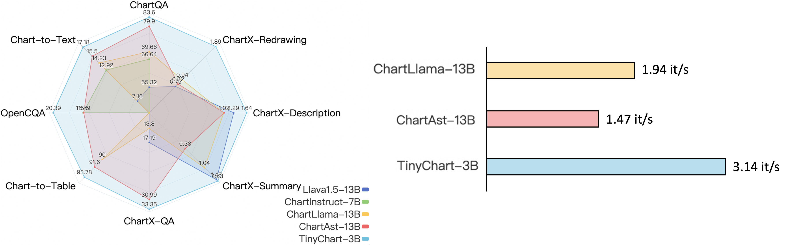

# TinyChart: Efficient Chart Understanding with Visual Token Merging and Program-of-Thoughts Learning

<div align="center">
Liang Zhang*, Anwen Hu*, Haiyang Xu, Ming Yan, Yichen Xu, Qin Jin†, Ji Zhang, Fei Huang

\* Equal Contribution 
† Corresponding Author


</div>


<div align="center">
<a href="https://arxiv.org/abs/2404.16635"></a>
</div>

<hr>
<div align="center">

</div>
</p>

## Spotlights

* Support chart question answering with both simple direct answers and step-by-step Python programs.
* Support chart-to-table extraction, chart summary generation, and chart redrawing.
* Available
    - ✅ Model: TinyChart
    - ✅ Inference code.
    - ✅ Code of launching a local demo.
    - ✅ Online demo on HuggingFace.
* Coming soon
    - [ ] Online demo on ModelScope.
    - [ ] Evaluation code.
    - [ ] Training data and code.

## Examples
<div align="center">

</div>

## Online Demo
[🤗 Huggingface Space](https://huggingface.co/spaces/mPLUG/TinyChart-3B)

## Models
### Model Card
|  Model   | Download Link  |
|  ----  | ----  |
| TinyChart@768  | [🤗 mPLUG/TinyChart-3B-768](https://huggingface.co/mPLUG/TinyChart-3B-768) <br> [🤖 iic/TinyChart-3B-768](https://modelscope.cn/models/iic/TinyChart-3B-768)|
| TinyChart@768-SigLIP | [🤗 mPLUG/TinyChart-3B-768-siglip](https://huggingface.co/mPLUG/TinyChart-3B-768-siglip) <br> [🤖 iic/TinyChart-3B-768-siglip](https://modelscope.cn/models/iic/TinyChart-3B-768-siglip)

Note that to use TinyChart@768, you should load the vision transformer with token merging from TinyChart@768-SigLIP. If you download the model into local directory, you should change `mm_vision_tower` in `config.json` of `TinyChart-3B-768` to make sure it can find `TinyChart-3B-768-siglip`.

### Quick Start
You can load the model with the following code.
```
from tinychart.model.builder import load_pretrained_model

model_path = "mPLUG/TinyChart-3B-768"
tokenizer, model, image_processor, context_len = load_pretrained_model(
    model_path, 
    model_base=None,
    model_name=get_model_name_from_path(model_path),
    device="cuda"
)
```

### Model Inference
We provide an example script to perform inference in [`inference.ipynb`](inference.ipynb).


## Local Demo
You can run a local demo with the following scrit:
```
python app.py --model-path <your_model_path>
```

## Citation
If you find this work useful, consider giving this repository a star ⭐️ and citing 📝 our paper as follows:
```
@misc{zhang2024tinychart,
    title={TinyChart: Efficient Chart Understanding with Visual Token Merging and Program-of-Thoughts Learning}, 
    author={Liang Zhang and Anwen Hu and Haiyang Xu and Ming Yan and Yichen Xu and Qin Jin and Ji Zhang and Fei Huang},
    year={2024},
    eprint={2404.16635},
    archivePrefix={arXiv},
    primaryClass={cs.CV}
}
```

## Acknowledgement
The code is based on the [TinyLLaVA](https://github.com/DLCV-BUAA/TinyLLaVABench), [LLaVA](https://github.com/haotian-liu/LLaVA), and [ToMe](https://github.com/facebookresearch/ToMe). Thanks for these great works and open-sourcing!