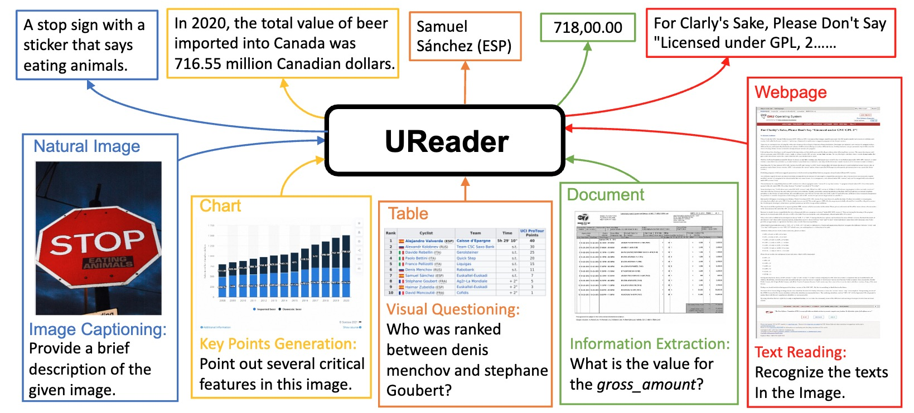

# UReader: Universal OCR-free Visually-situated Language Understanding with Multimodal Large Language Model

<div align="center">

Jiabo Ye*, Anwen Hu*, Haiyang Xu, Qinghao Ye, Ming Yan, Guohai Xu, Chenliang Li, Junfeng Tian, Qi Qian, Ji Zhang, Qin Jin, Liang He, Xin Lin, Fei Huang

*Equal Contribution

</div>
<hr>
<div align="center">
<a href="http://mm-chatgpt.oss-cn-zhangjiakou.aliyuncs.com/mplug_owl_demo/released_checkpoint/UReader_Arxiv.pdf"></a>
<a href="https://arxiv.org/abs/2310.05126"></a></div>
<div align="center">
<a href="https://huggingface.co/datasets/Mizukiluke/ureader-instruction-1.0">Dataset 🤗</a>
<a href="https://huggingface.co/Mizukiluke/ureader-v1">Model 🤗</a></col>



</div>

## Instruction-tuning dataset
Download the jsonl files and images from [Mizukiluke/ureader-instruction-1.0](https://huggingface.co/datasets/Mizukiluke/ureader-instruction-1.0/tree/main).

The jsonl files can be placed in ```ureader_json/```. And the images can be orgnized in such format:
```
ureader_images
├── ChartQA
├── DUE_Benchmark
│   ├── DeepForm
│   ├── DocVQA
│   ├── InfographicsVQA
│   ├── KleisterCharity
│   ├── TabFact
│   └── WikiTableQuestions
├── TextCaps
├── TextVQA
└── VisualMRC
```

## Training, Inference and Evaluation
### Environment
Follow [mPLUG-Owl](https://github.com/X-PLUG/mPLUG-Owl) to prepare your environment.

We validate the codes with: 
* PyTorch 1.13.1
* CUDA 11.7
* transformers 4.29.1.

### Training
Prepare the checkpoint of mPLUG-Owl from [https://huggingface.co/MAGAer13/mplug-owl-llama-7b](https://huggingface.co/MAGAer13/mplug-owl-llama-7b). Put the download checkpoint in ```checkpoints/mplug-owl-llama-7b```.

For A100 80G
```
bash scripts/train_it.sh
```
For V100 32G
```
bash scripts/train_it_v100.sh
```

### Inference
We provide interface to build model and processer in ```pipeline/interface.py```. You can refer to ```pipeline/evaluation.py``` for more specific usage.

A offline demo can be start by ```python -m app```

### Evaluation
* Install java for pycocoevalcap. 
```
sudo apt update
sudo apt install default-jdk
```
* Download and unzip benchmark_files.zip at ```benchmark_files```.
* Download and unzip ureader_json.zip at ```ureader_json```.
* Pull checkpoint from [https://huggingface.co/Mizukiluke/ureader-v1/tree/main](https://huggingface.co/Mizukiluke/ureader-v1/tree/main)(If you are suffering from connection issue with huggingface, we provide a [zip download link](http://yejiabo.oss-cn-zhangjiakou.aliyuncs.com/checkpoints/UReader/ureader.tar)) to ```checkpoints/ureader``` or use ```--eval_checkpoint``` to specify the weight which should be evaluated.

The evaluation consists of two stage.

In the first stage, we export the model output by running```NPROC_PER_NODE=1 bash scripts/eval/eval_benchmark.sh```. You can also set distributed environment variables to enable distributed inference.

In the second stage, we evaluate the model output by running ```python -m pipeline.eval_utils.run_evaluation```.


## Citation
If you found this work useful, consider giving this repository a star and citing our paper as followed:
```
@misc{ye2023ureader,
      title={UReader: Universal OCR-free Visually-situated Language Understanding with Multimodal Large Language Model}, 
      author={Jiabo Ye and Anwen Hu and Haiyang Xu and Qinghao Ye and Ming Yan and Guohai Xu and Chenliang Li and Junfeng Tian and Qi Qian and Ji Zhang and Qin Jin and Liang He and Xin Alex Lin and Fei Huang},
      year={2023},
      eprint={2310.05126},
      archivePrefix={arXiv},
      primaryClass={cs.CV}

@misc{ye2023mplugdocowl,
      title={mPLUG-DocOwl: Modularized Multimodal Large Language Model for Document Understanding}, 
      author={Jiabo Ye and Anwen Hu and Haiyang Xu and Qinghao Ye and Ming Yan and Yuhao Dan and Chenlin Zhao and Guohai Xu and Chenliang Li and Junfeng Tian and Qian Qi and Ji Zhang and Fei Huang},
      year={2023},
      eprint={2307.02499},
      archivePrefix={arXiv},
      primaryClass={cs.CL}
}
}
```